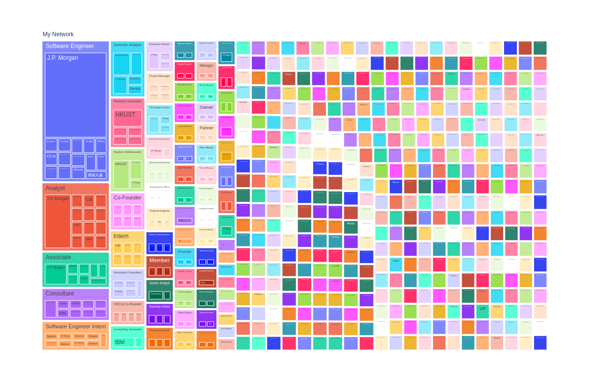
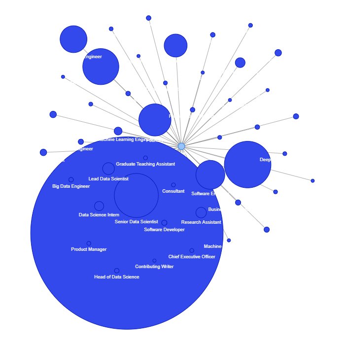
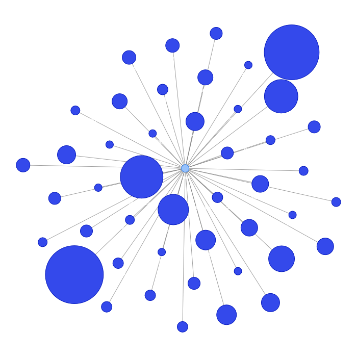
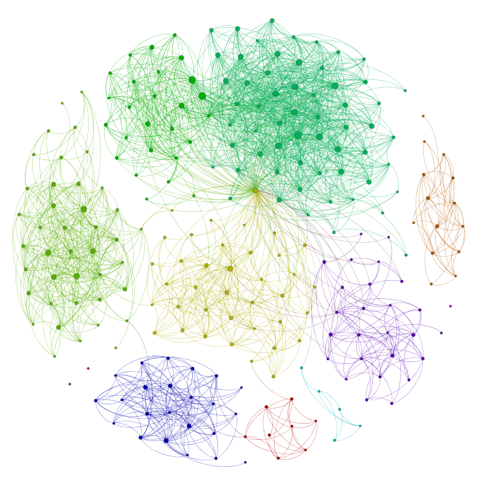

Out of date...

# Ideas

Social network of all characters in the universe of the Malazan books of the Fallen  
What we want to see:
- Character information
	- name
	- race
	- death (toggle)
	- affiliations
	- warren (dt.: Gewirr)
- Character relations  
	as directed edges for
	- love
	- hate
	- known
	- killed
	- blood relations
- Book appearances and events
	- first appearance of characters in books
	- acquaintance and relation developments
	- congruency events
- Timeline of characters and relations
	- birth and death dates
	- acquaintances
- Map of the world
	- continents
	- cities
	- warrens
	- events

# Python Libraries

- Plotly  
https://plotly.com/python/
- Pajek (Ljubljana)  
http://mrvar.fdv.uni-lj.si/pajek/
- NetworkX + Pyvis  
https://networkx.org/  
https://pyvis.readthedocs.io/en/latest/index.html#
- Gephi  
https://gephi.org/
- Jaal  
https://github.com/imohitmayank/jaal

## Other (Statistical Data) Viz Libraries

Seaborn, Tueplots
<!--  -->

<!-- ## Overviews -->

<!-- https://mode.com/blog/python-interactive-plot-libraries/ -->

# Examples

## Plotly

https://towardsdatascience.com/visualizing-my-linkedin-network-c4b232ab2ad0

## NetworkX + Pyvis

https://medium.com/bitgrit-data-science-publication/visualize-your-linkedin-network-with-python-59a213786c4
<!--  -->
<!--  -->
Position | Company
:-:|:-:
 | 

## Gephi

http://allthingsgraphed.com/2014/08/28/facebook-friends-network/

# Reading

- Data Visualization with Python and JavaScript  
https://learning.oreilly.com/library/view/-/9781098111861/?ar
- Python3 - Das umfassende Praxisbuch  
https://learning.oreilly.com/library/view/-/9783747500538/?ar
- Ted Ralphs  
https://coral.ise.lehigh.edu/~ted/teaching/ie411/
